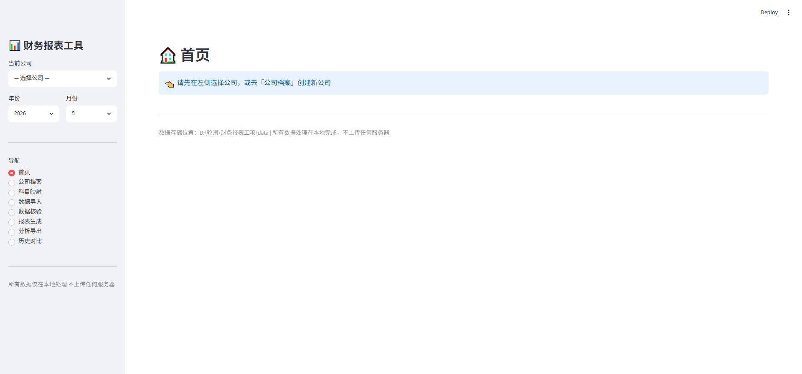
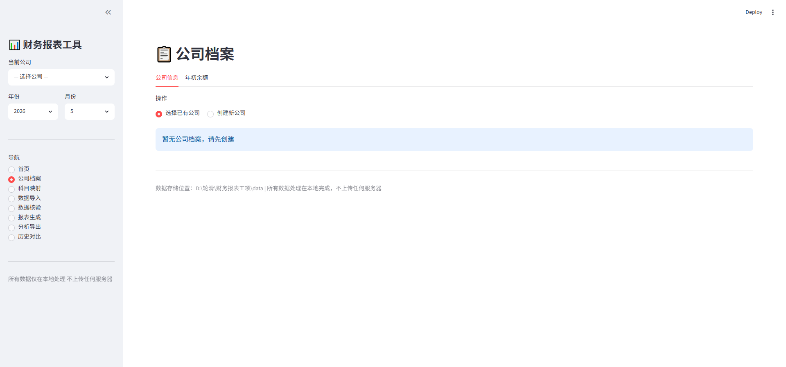
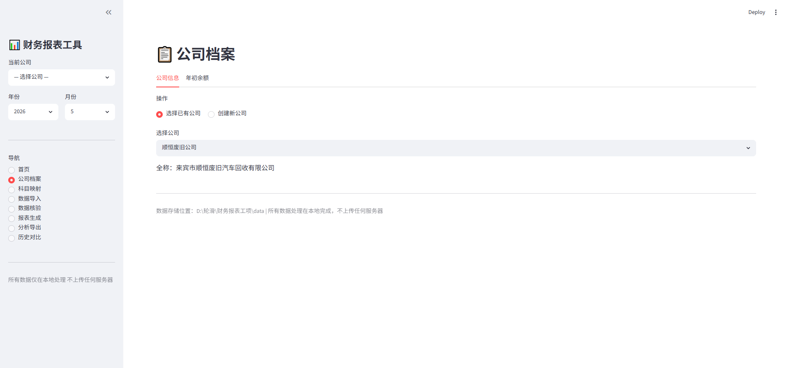
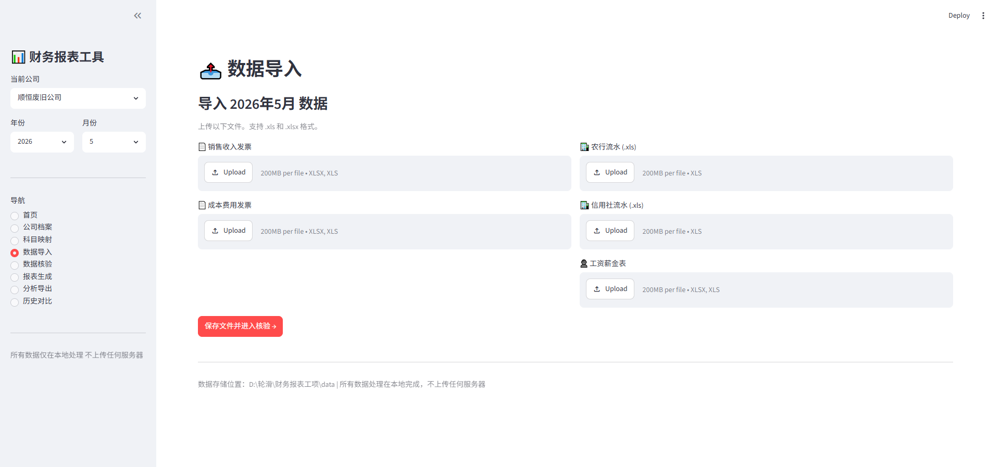
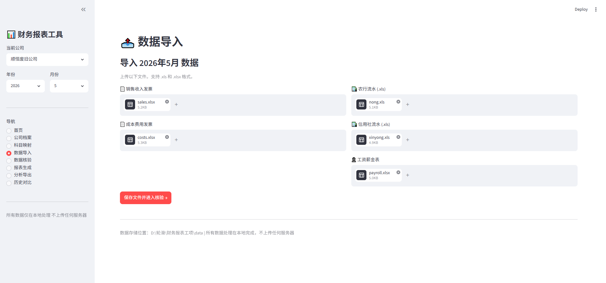
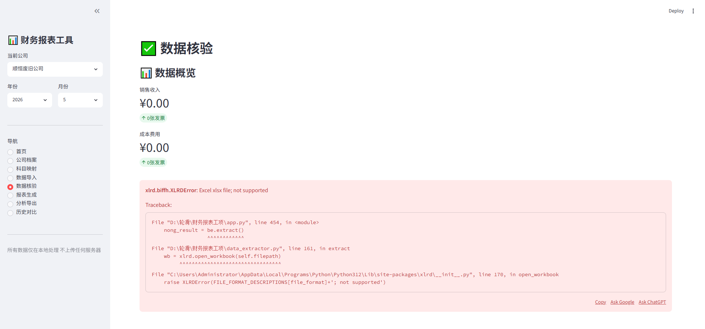
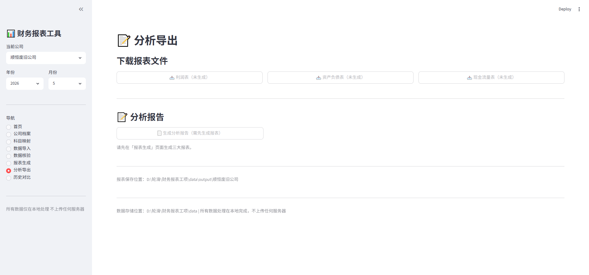

# 📊 财务报表生成工具 — 使用教程

> 本教程带你一步一步完成从零到生成完整财务报表的全过程。
> 预计首次设置约 **10 分钟**，之后每月使用约 **3 分钟**。

---

## 🚀 启动工具

打开 `D:\轮滑\财务报表工项` 文件夹，**双击 `启动报表工具.bat`**。

或者在终端中运行：
```bash
cd D:\轮滑\财务报表工项
streamlit run app.py
```

启动后，浏览器打开 **http://localhost:8501**，你将看到以下界面：



界面左侧是导航栏，包含 8 个功能页面。顶部显示当前选中的公司和年月。

---

## 📝 第一步：创建公司

点击左侧导航的 **「公司档案」**：


在表单中填写：
- **简短名称**：用于文件命名，如 `顺恒废旧公司`
- **公司全称**：用于报表抬头，如 `来宾市顺恒废旧汽车回收有限公司`

点击 **「创建新公司」** 按钮：



创建成功后，左侧上方的「当前公司」下拉框会自动选中新公司。

---

## 📋 第二步：填写年初余额

创建公司后，页面下方会自动出现 **「年初余额」** 表单。

> 💡 **数据来源**：打开去年 12 月的资产负债表，将「期末余额」一列的数值填入对应的「年初余额」输入框。


必须填写的主要科目：

| 资产类 | 负债及权益类 |
|--------|-------------|
| 货币资金 | 应付账款 |
| 应收账款 / 预付账款 | 其他应付款 |
| 存货 | 实收资本（或股本） |
| 固定资产原价 | 未分配利润 |
| 资产总计 | |

> ⚠️ **提示**：资产总计 = 负债和所有者权益总计，系统会用这个公式来校验。

填完后点击 **「💾 保存年初余额」**，保存成功会有绿色提示。

---

## 🔗 第三步：配置科目映射

点击左侧 **「科目映射」**。

这一步的作用是：告诉系统「发票上的科目编码对应报表里的哪一行」。



### 操作方式

1. 选择报表类型标签（利润表 / 资产负债表 / 现金流量表）
2. 点击 **「📤 上传发票自动识别」**，上传一张历史成本发票
3. 系统会自动列出发票中出现的所有科目编码
4. 在下拉框中为每个编码选择它对应的报表行

> 💡 **为什么需要这一步**：不同公司的科目编码体系不同（如 `5001` 可能代表营业成本，也可能代表管理费用）。只需在首次使用时配置一次，之后每月自动复用。

---

## 📥 第四步：导入当月数据

点击左侧 **「数据导入」**。



每个月需要上传 **5 个文件**：

| 序号 | 文件 | 格式要求 | 说明 |
|------|------|----------|------|
| 1 | 销售收入发票 | `.xlsx` | 金蝶导出的「信息汇总表」 |
| 2 | 成本费用发票 | `.xlsx` | 同上 |
| 3 | 农行银行流水 | `.xls` | 农行导出的标准格式 |
| 4 | 信用社银行流水 | `.xls` | 信用社导出的标准格式 |
| 5 | 当月工资表 | `.xlsx` | 含「合计」行的工资表 |

上传完成后，页面会显示数据预览：



点击 **「导入数据」** 按钮，数据将保存到本地 `data/uploads/` 目录。

---

## 🔍 第五步：数据核验

导入数据后，系统自动跳转到 **「数据核验」** 页面。


这一页会展示：
- 📊 **数据摘要**：发票张数、收入总额、成本总额等
- 🏦 **银行数据**：收入合计、支出合计、期末余额
- 👥 **工资数据**：当月工资应发合计

核验结果会显示在下方：
- ✅ 绿色 = 核验通过
- ⚠ 黄色 = 轻微警告（如发票数量比上月少，可能漏传）
- 🔴 红色 = 严重问题（如银行余额不匹配）

确认无误后，点击 **「确认无误，生成报表 →」**。

---

## 📊 第六步：生成三大报表

在 **「报表生成」** 页面，点击 **「🚀 生成三大报表」**：



系统会自动完成：
1. 利润表计算（营业收入 → 净利润）
2. 资产负债表计算（A = L + E 自动平衡）
3. 现金流量表计算（直接法 + 间接法）
4. 格式渲染（宋体/Arial，完整边框）
5. 保存 summary 数据用于历史对比

生成完成后，页面会显示关键指标：


> 🎯 系统还会进行 **自动校验**：
> - ✅ 资产负债表平衡检查（A - L - E = 0）
> - ✅ 银行余额核对
> - ✅ 利润表勾稽关系

### 批量生成（多月份）

如果你有多个历史月份的数据，页面上方会出现 **「⚡ 批量生成」** 区域：

- 系统自动扫描 `data/uploads/` 目录中已有数据的所有月份
- 多选月份后，点击「批量生成」即可一键生成
- 进度条实时显示每月的处理状态

---

## 📝 第七步：分析导出

进入 **「分析导出」** 页面：


### 下载报表

三个按钮分别下载：
- 📥 **利润表** (.xlsx)
- 📥 **资产负债表** (.xlsx)
- 📥 **现金流量表** (.xlsx)

### 生成分析报告

点击 **「📄 生成分析报告（Word）」**，系统自动生成一份 Word 格式的财务分析报告，包含：

| 板块 | 内容 |
|------|------|
| 一、报表编制基础 | 数据来源、会计准则 |
| 二、整体经营情况 | 收入/成本/毛利/净利率分析 |
| 三、资产负债状况 | 期末 vs 年初对比，自动检测风险 |
| 四、现金流量分析 | 直接法 + 间接法，盈利质量评估 |
| 五、税务分析 | 增值税及附加明细 |
| 六、综合评估 | 🔴 风险信号 + 🟢 积极信号 |
| 七、建议 | 针对性改进建议 |

> 💡 报告会**自动检测异常**并标注：
> - 🟡 毛利率偏低
> - 🔴 资不抵债
> - ⚠ 现金流薄弱
> - ⚠ 管理费用占比过高

---

## 📈 第八步：历史对比

进入 **「历史对比」** 页面：



- **多选月份**：勾选要对比的月份（可多选）
- **利润表对比**：所有关键指标横排展示
- **资产负债表对比**：期末余额横向对比
- **两月对比时**：自动计算变动额 + 变动率
  - >30% 增长 ⚠ 警告
  - >50% 增长 🔴 严重预警
- **三月及以上**：自动显示趋势方向（↑ 上升 / ↓ 下降）
- **异常波动检测**：自动列出变动超过 30% 的科目

点击 **「📥 导出对比表 (Excel)」** 可下载完整对比 Excel 文件。

---

## 🔄 每月使用流程（3 分钟）

```
月初拿到数据
    │
    ├─ 进入「数据导入」
    │  上传 5 个文件 → 点「导入数据」
    │
    ├─ 自动跳转「数据核验」
    │  看一眼确认数字对 → 点「确认无误」
    │
    ├─ 进入「报表生成」
    │  点「生成三大报表」
    │
    ├─ 进入「分析导出」
    │  下载三表 + 生成分析报告
    │
    └─ 进入「历史对比」
       查看本月 vs 上月对比，关注异常波动
```

---

## ❓ 常见问题

| 提示 | 怎么办 |
|------|--------|
| 🔴 "发现新的科目编码" | 去「科目映射」页给它分类 |
| 🔴 "资产负债表不平" | 检查年初余额是否正确填写 |
| ⚠ "发票数比上月少很多" | 确认是否漏传了文件 |
| ⚠ "银行流水格式不匹配" | 确认文件是农行/信用社标准格式 |

---

## 🔒 安全说明

- ✅ **全本地处理**：所有计算在您的电脑上完成
- ✅ **不上传数据**：没有任何后端服务器
- ✅ **无需联网**：不发起任何网络请求
- ✅ **数据位置**：`D:\轮滑\财务报表工项\data\` 目录

---

> 📅 更新日期：2026年6月29日
